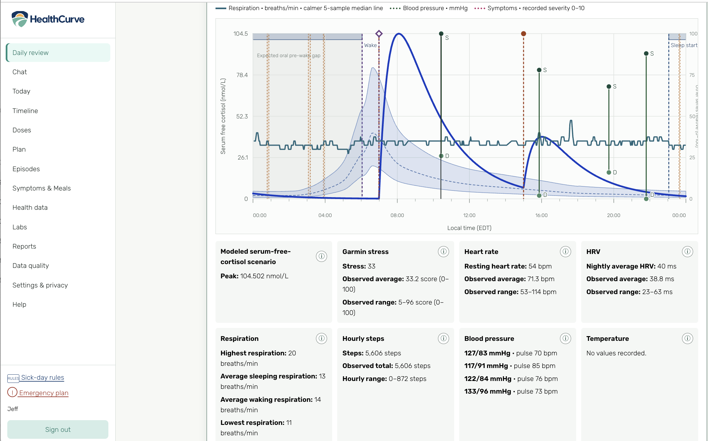
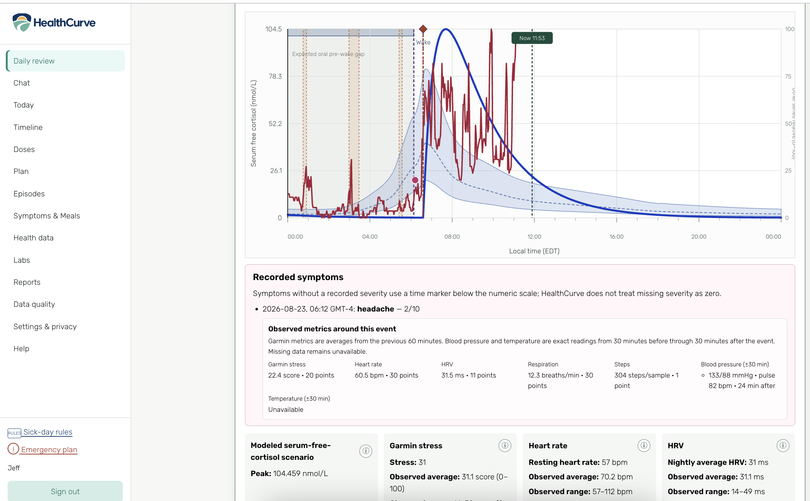

# HealthCurve

A private personal health record and analysis application, focused on living without
adrenal glands and managing adrenal insufficiency.

HealthCurve is **not** a diagnostic product, an emergency service, or an autonomous
medication adviser. Its first obligation is a trustworthy longitudinal record.
Analytics and AI are derived views, never substitutes for medical facts or a
physician-approved plan.

## What HealthCurve does today

HealthCurve brings the parts of a day onto one private, owner-only timeline:
actual medication doses, symptoms and diary entries, stress episodes, blood
pressure and pulse, Garmin observations, sleep, labs, and the medication plan that
was effective at the time.

Its defining view is **HealthCurve**, a selected-day, interactive comparison built
from actual recorded dose times. It plots a versioned theoretical exposure shape for
supported immediate-release oral hydrocortisone, including absorption, half-life,
carryover from the prior day, and the summed effect of doses taken close together.
Focused controls compare that shape with Garmin stress, heart rate, HRV,
respiration, blood pressure, body temperature, symptoms, stress episodes, and sleep on the same local
time axis. Hover, keyboard, and mobile controls reveal the exact time and native
value; the adjacent table remains authoritative. Daily and nightly Garmin summaries
without an observation time are shown as context rather than invented as intraday
points.

The exposure-model selector keeps four separately versioned views available:

**Full cortisol model (v4)** is the default Daily Review view. The shorter product
name describes the complete current model without encoding its supported routes in
the selector label; its exact evidence and route boundaries remain documented below.

- `hc-exposure-v1` is a relative oral-dose exposure shape in relative exposure units
  (REU). Its height is useful for comparing the timing of modeled peaks and troughs,
  but it is not a cortisol concentration.
- `hc-physiology-v2` is a population-parameter plasma-free-cortisol scenario in
  nmol/L.
- `hc-wake-free-v3` is a binding-aware, wake-anchored serum-free-cortisol scenario in
  absolute nmol/L free. Select **Wake-anchored free cortisol (v3)** in Daily Review to
  use it. Its modeled curve and healthy reference are never independently normalized;
  both use the same stable serum-free-cortisol axis, while non-cortisol health series
  continue to use the separate relative display axis.
- `hc-mixed-route-free-v4` preserves the v3 oral calculation and adds a separately
  evidenced model for exact recorded **50 mg and 100 mg intravenous-push
  hydrocortisone**. The 50 mg contribution uses the published population fit; 100 mg
  uses an explicit 2× dose-proportional scenario of that fit. Other injection amounts
  and routes remain visible recorded facts but are not modeled.

### Wake-anchored free cortisol (v3)

V3 builds a deterministic Bateman absorption/elimination curve from every supported
recorded immediate-release oral hydrocortisone dose, using the actual administration
time. Dose contributions—including doses taken close together—are summed in serum
free cortisol. The owner-revisable population defaults for elimination half-life,
time to peak, distribution volume, and oral bioavailability are stored as immutable
model-parameter revisions so a historical result remains explainable. Derived total
cortisol is available only as display context; it does not drive the free-cortisol
curve or symptom correlations.

The optional **Wake-anchored healthy P5–P95 reference** is a wide healthy-adult
population context band, not a personal target. HealthCurve regenerates it for each
selected day from that day's observed Garmin final wake and relevant sleep onset. Up
to the first three confirmed meal-time facts may add population-reference meal pulses
at their exact observed times; meal size is retained as context but does not scale a
pulse, unrecorded meals are never invented, and meals never alter the medication PK
curve. If the required observed sleep timing is missing, the band remains unavailable
rather than substituting an invented wake time. The expected pre-wake gap from an
immediate-release oral regimen is context, not an alert.

V3 and its reference are modeled estimates, not cortisol measurements, conclusions
about adequate coverage, personal targets, warnings, or dosing advice. Recorded
stress and symptoms remain context: HealthCurve does **not** convert them into a
personal cortisol “needed” or medication-demand curve. Symptoms and physician advice
take precedence over any visualization. The formulas, parameters, primary evidence,
limitations, and model comparison are published in the Analytics page and
[the user guide](docs/using-healthcurve.md#exact-healthcurve-formulas-and-evidence).

### Full cortisol model (v4)

V4 leaves every v3 oral-dose calculation unchanged. Each current, confirmed 50 mg
intravenous-push hydrocortisone fact contributes the evidence-versioned total-serum
increment `1347 × exp(-0.27 × elapsed_hours)` nmol/L from its actual administration
time. The fitted elimination half-life is about 2.57 hours. Repeated doses sum and do
not require an approved plan. HealthCurve uses its existing nonlinear binding model
to combine the IV total-cortisol increment with oral free cortisol and display the
result on the shared absolute free-cortisol axis.

This is a population-parameter estimate for reviewing recorded facts—not a measured
cortisol value, receptor-effect model, medication-adequacy test, or dosing guide. The
exact evidence boundary and primary sources are recorded in
[ADR-0027](docs/adr/0027-evidence-versioned-50mg-iv-push-hydrocortisone-model.md).

For longer review, HealthCurve compares deterministic day-level features across up
to 366 days, keeps missing data explicit, and can optionally ask the private local
model to draft a cited descriptive summary. That draft remains labeled AI analysis;
it cannot change facts, plans, or medication instructions.

## The three categories

Everything stored belongs to exactly one of three categories, kept separate in
storage, API, UI, exports, and reports:

| | Authority | Can AI create it? |
|---|---|---|
| **Recorded fact** | The user and their devices | No |
| **Physician-approved plan** | A clinician, with provenance | No |
| **AI analysis** | Derived only, always labeled and cited | Yes |

These boundaries are specified in [docs/safety-spec.md](docs/safety-spec.md) as 29
numbered rules (`SAFE-01`…`SAFE-29`) and enforced by tests that name their rule ID.
CI fails if a rule marked `enforced` loses its coverage.

## Documentation

| Document | What it is |
|---|---|
| [docs/HealthCurve_Project_Plan.md](docs/HealthCurve_Project_Plan.md) | Product intent and architecture (the source document) |
| [docs/using-healthcurve.md](docs/using-healthcurve.md) | Current owner workflows, HealthCurve formulas, and shipped limitations |
| [docs/safety-spec.md](docs/safety-spec.md) | Normative safety rules `SAFE-01`…`SAFE-29` |
| [docs/safety-rules.yaml](docs/safety-rules.yaml) | Machine-readable rule index used by the CI gate |
| [docs/threat-model.md](docs/threat-model.md) | Threats `T1`…`T7` and data classification `C0`…`C13` |
| [docs/adr/](docs/adr/) | Architecture decision records |
| [docs/roadmap.md](docs/roadmap.md) | What is left to build, and why it is ordered that way |
| [docs/beads-workflow.md](docs/beads-workflow.md) | Verified Beads commands and the working loop |
| [docs/telegram-setup.md](docs/telegram-setup.md) | Step-by-step guide to connecting the Telegram bot |
| [docs/tailscale-hosting.md](docs/tailscale-hosting.md) | Actual localhost/Tailscale Serve runtime, restart, and safe verification |
| [docs/credential-encryption.md](docs/credential-encryption.md) | Store, rotate, and recover integration encryption keys |
| [docs/garmin-import.md](docs/garmin-import.md) | Review and import owner-exported Garmin FIT/CSV data |
| [docs/garmin-connect.md](docs/garmin-connect.md) | Configure isolated read-only automatic Garmin sync |
| [docs/backup-runbook.md](docs/backup-runbook.md) | Encrypted backup setup, monitoring, retention, and recovery operations |
| [docs/private-release-checklist.md](docs/private-release-checklist.md) | Executable gates before relying on the private localhost/Tailscale deployment |
| [docs/frontend-bundle-budget.md](docs/frontend-bundle-budget.md) | Frontend route-loading strategy and enforced size budget |

Build status lives in Beads, not in this file. Run `bd ready` to see claimable work, and
read [docs/roadmap.md](docs/roadmap.md) for what remains and in what order.

## Screenshots

[](docs/screenshots/README.md)

<sub>Daily HealthCurve — modeled medication exposure, a healthy cortisol reference band, wearable signals, and recorded events on one timeline.</sub>

[](docs/screenshots/README.md)

<sub>Symptom context — review a recorded symptom with preceding wearable metrics and nearby blood-pressure or temperature readings.</sub>

[View all screenshots, including Telegram entry and commands, the timeline, medication plan, manual entry, and reports.](docs/screenshots/README.md)

## License

HealthCurve is source-available under the
[PolyForm Noncommercial License 1.0.0](LICENSE). You may use, modify, and distribute
the software only for purposes permitted by that license. Commercial use requires
separate permission from the licensor. HealthCurve is therefore not OSI-approved
open-source software.

## Requirements

- [uv](https://docs.astral.sh/uv/) — provisions Python 3.13 (ADR-0006) and locks deps
- Docker with Compose — PostgreSQL, Redis, Caddy, API, and background workers
- Native [Ollama](https://ollama.com/) — optional private model-backed drafts;
  deterministic recording, analytics, and emergency information work without it
- Node.js 24 or newer — builds and tests the locked React client
- [Beads](https://github.com/gastownhall/beads) (`bd`) — issue tracking, mandatory

The host's system Python is not used. `uv` installs and pins 3.13.

## Getting started

```bash
make setup                 # pinned Python and frontend dependencies
cp .env.example .env       # then set POSTGRES_PASSWORD and POSTGRES_AI_PASSWORD

make check                 # lint, types, module boundaries, tests
make up                    # start the local stack
make migrate               # apply migrations (never automatic -- ADR-0002)
```

`make help` lists every target.

On the normal macOS installation, Ollama runs natively on loopback and containers
reach it through `http://host.docker.internal:11434`; ordinary `make up` does not
start or download a model container. Run `ollama list` on the host to verify the
configured model. The old container topology remains an explicit compatibility
profile only. See [the private hosting guide](docs/tailscale-hosting.md) and
[ADR-0017](docs/adr/0017-host-native-ollama-default.md).

The web client is a React/TypeScript SPA in `frontend/`; the emergency page remains
server-rendered by FastAPI. `make frontend-generate` refreshes the committed OpenAPI
contract and generated types, and `make frontend-check` runs its contract, lint, test,
and production-build gates. See [docs/web-frontend-guide.md](docs/web-frontend-guide.md).

### Putting your own data in

Everything below runs inside the `api` container, which is on the private network.

```bash
# 1. Your account. HealthCurve is single-owner; this can only be run once.
docker compose run --rm api python -m healthcurve.cli create-owner \
    --email you@example.com --timezone Europe/London

# 2. A template for your medications and schedule.
docker compose run --rm -v "$PWD:/out" api \
    python -m healthcurve.cli init-medications-file /out/medications.yaml

# 3. Fill medications.yaml in from your prescription and your physician's written
#    instructions, then load it. This creates a DRAFT regimen.
docker compose run --rm -v "$PWD/medications.yaml:/tmp/m.yaml:ro" api \
    python -m healthcurve.cli load-medications /tmp/m.yaml

# 4. Approve it. A draft is never treated as your plan, and approval requires
#    naming who approved it and where it came from (SAFE-16).
docker compose run --rm api python -m healthcurve.cli approve-regimen <id> \
    --by "Dr Name, Endocrinology" --source "clinic letter 2026-01-01"
```

Then connect Telegram by following [docs/telegram-setup.md](docs/telegram-setup.md).

## Telegram, Garmin, and Beads

**Telegram** is an optional fast capture interface. HealthCurve polls Telegram
outbound, so no webhook or public application endpoint is required. Deterministic
commands record facts; supported free text becomes a reviewable draft that requires
confirmation before high-impact fields become facts. The local Ollama model can help
structure those drafts but cannot approve a plan or write directly to the record.
Telegram itself retains chat history on Telegram's servers, so use the web app when
that external copy is undesirable. When the bot asks a product-request clarification,
HealthCurve keeps a bounded owner/chat-scoped working window (three hours by default)
so the next short answer can resolve that question across worker restarts. A cancel,
undo, or new explicit command clears or supersedes it; it never becomes a health fact
or physician-approved plan. `/bd-list` and `/bd-status` return bounded output
from the trusted host's fixed `bd list` and `bd status` operations. `/bd-add` creates a
structured product request for later review; `/beads-add` remains a compatibility
alias. None of these commands automatically implements or deploys anything, and the
model can never supply a shell command or arguments.

**Garmin Connect** is an owner-selected, unofficial, read-only integration isolated
in its own worker. It imports supported daily and intraday stress, heart rate, HRV,
respiration, and sleep/awake observations with provider provenance. Missing data stays
missing. Garmin can change its private interface without notice, so reviewed
FIT/CSV/ZIP import remains available as a fallback. See
[Garmin Connect](docs/garmin-connect.md) and [Garmin import](docs/garmin-import.md).

**Beads** (`bd`) is the repository's durable engineering task and project-memory
system—not part of the personal health record. Priorities, dependencies, blockers,
claims, verification evidence, and multi-session handoffs live there instead of in
README task lists. `bd prime` restores project context and `bd ready` shows concrete
unblocked work. See [the Beads workflow](docs/beads-workflow.md).

## Layout

```text
src/healthcurve/
  app.py         FastAPI application factory (entry point)
  cli.py         operator commands: owner, medications, credentials, Telegram
  api/           routers, request/response schemas, shared dependencies
  identity/      owner account, sessions, authorization
  events/        canonical timeline, corrections, provenance
  medications/   medications, plan versions, dose slots, instructions
  episodes/      stress/up-dose and emergency injection workflows
  integrations/  Telegram, Garmin, location/timezone, weather
  labs/          panels, analytes, ranges
  ai/            extraction drafts, model registry, analysis, safety gate
  analytics/     deterministic metrics and aggregations
  reports/       snapshots, rendering, exports
  operations/    jobs, import batches, audit, backup status
```

Module boundaries follow ADR-0002 and are enforced in CI by an import-linter
contract — a cross-module import that bypasses a module's public interface fails
the build.

## Safety notes for contributors

- Never commit secrets or real health data. Fixtures are synthetic only (`SAFE-29`).
- A correction supersedes; it never overwrites (`SAFE-08`).
- Missing data is never stored as zero (`SAFE-10`).
- AI code paths cannot write facts or plans — this is a database privilege, not a
  convention (`SAFE-15`, `SAFE-16`).
- The emergency page must render with AI, integrations, and jobs all down
  (`SAFE-21`).
- No untracked implementation work. Pull the next task with `bd ready`.
