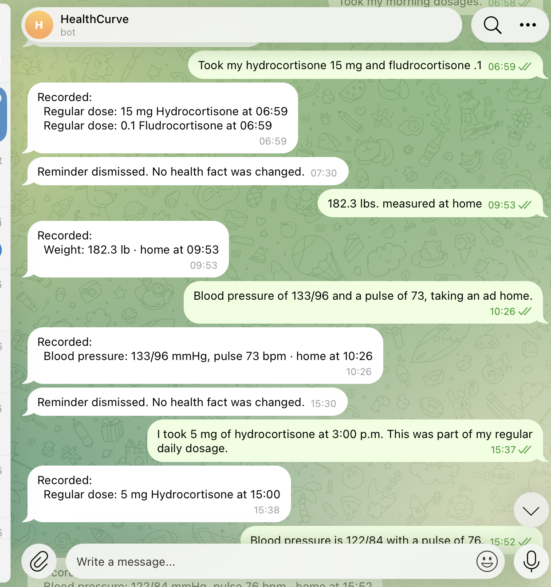
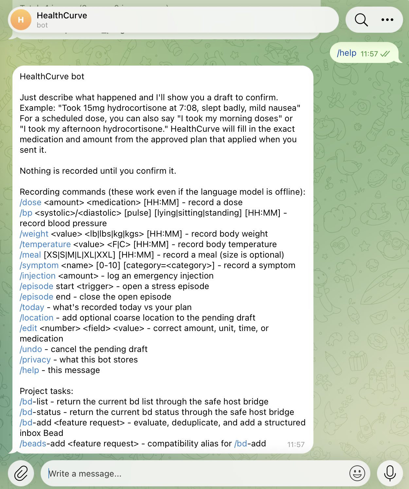
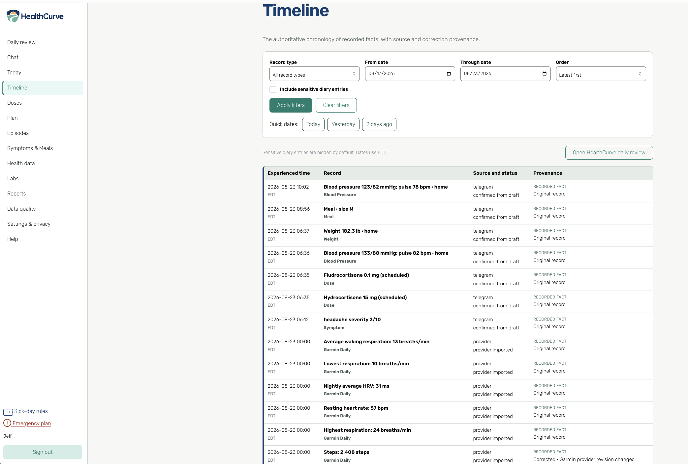
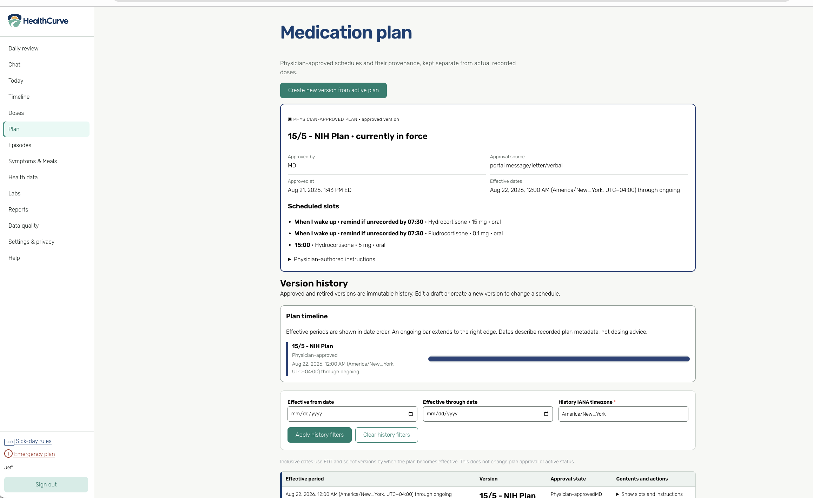
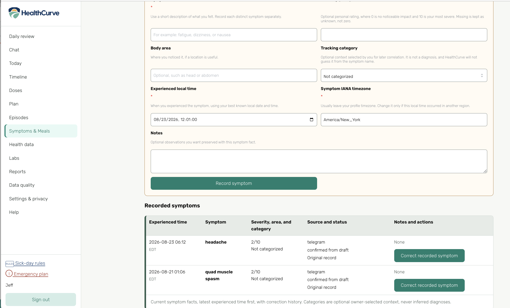
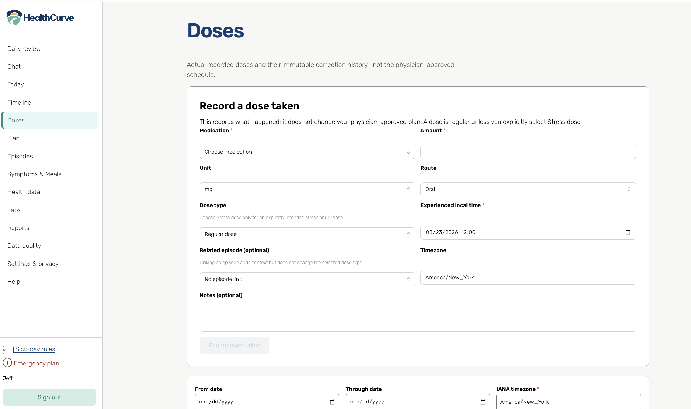
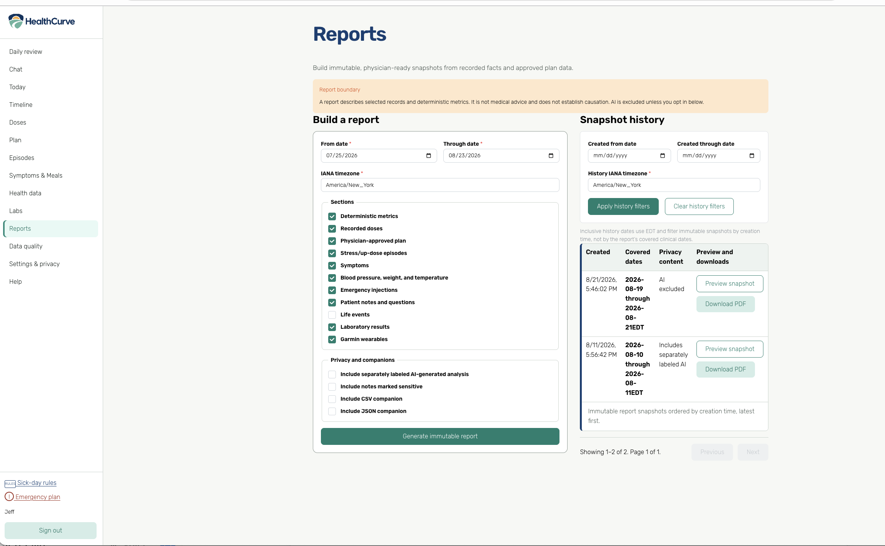

# HealthCurve screenshots

HealthCurve records and visualizes health data; it does not provide dosing advice.

## Daily HealthCurve

Daily HealthCurve — medication exposure, a healthy cortisol reference band, wearable signals, and recorded events on one timeline.

## Symptom context on the curve

Symptom context — a recorded symptom with preceding wearable metrics and nearby vital readings.

## Fast conversational logging

Telegram entry — record doses, weight, blood pressure, and other events in natural language.

## Telegram help

Telegram commands — view the complete command list and natural-language entry examples.

## Auditable timeline

Timeline — recorded facts with experienced time, source, confirmation state, and provenance.

## Versioned medication plan

Medication plan — physician-approved schedules remain separate from recorded doses.

## Symptoms and meals

Symptoms — record severity, category, time, and notes, then review history.

## Manual dose entry

Manual dose entry — record medication, amount, route, dose type, time, and context.

## Reports

Reports — build physician-ready snapshots and review report history.
